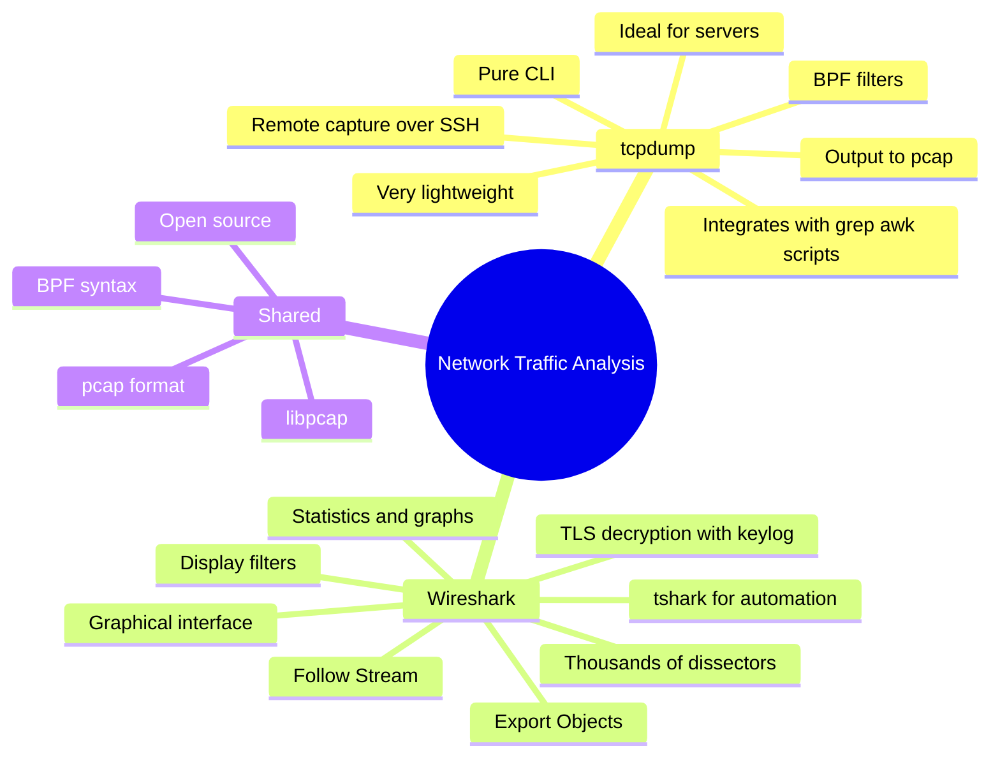
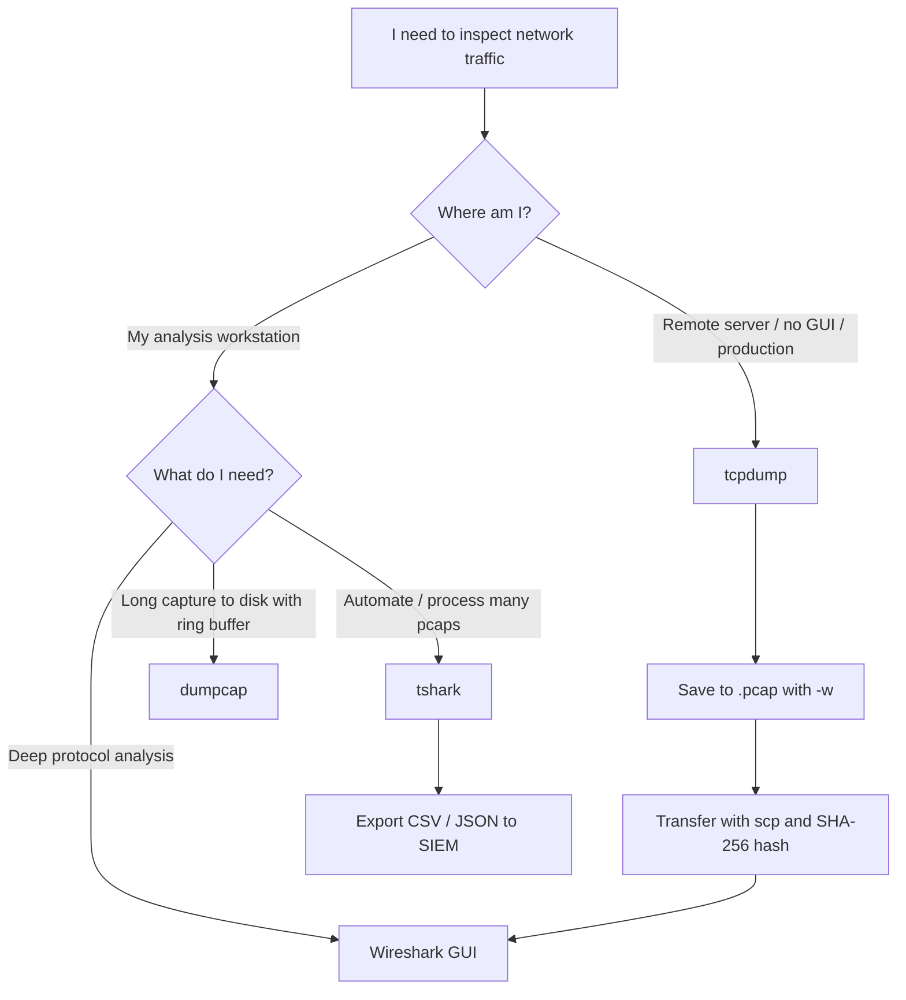
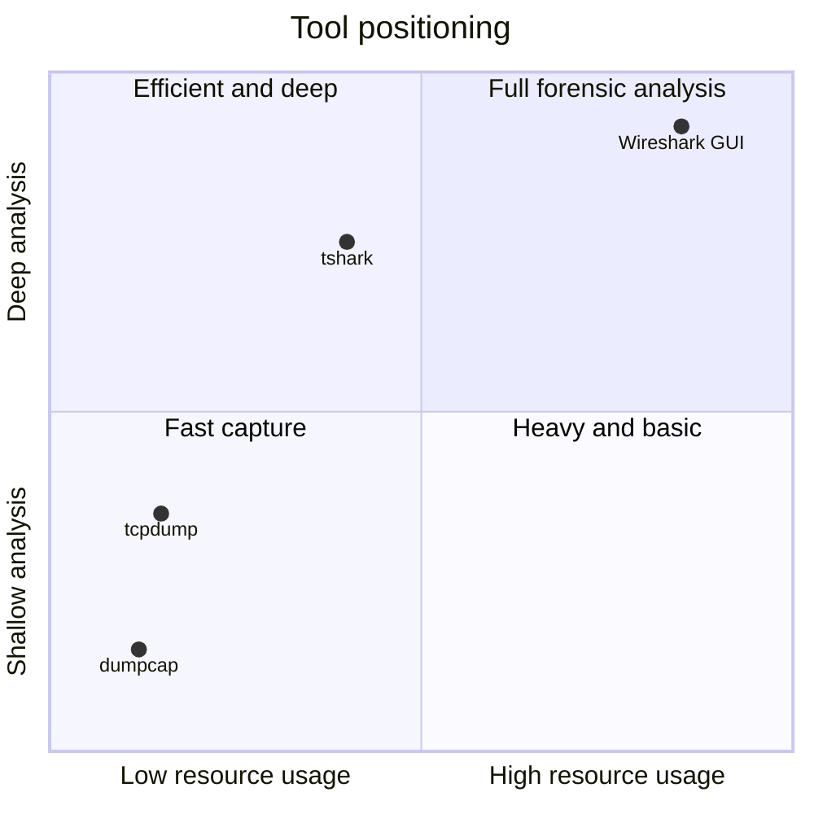
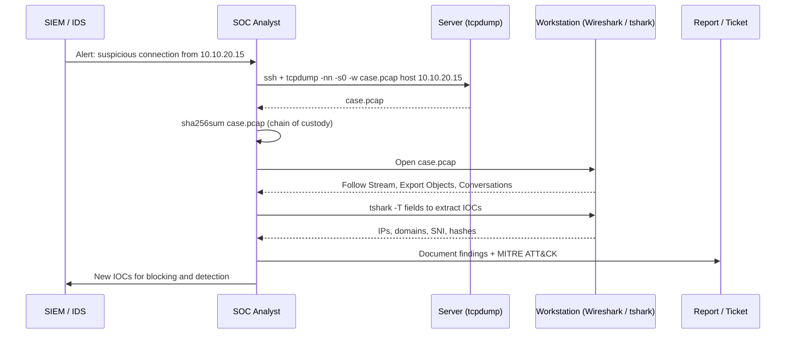

# 🛡️ Wireshark vs tcpdump — A Practical Comparison Guide for Cybersecurity Analysts


| Field | Details |
|---|---|
| **Author** | Luis González |
| **Profile** | Engineer and Master's Degree in Information Security |
| **Date** | 09/26/2026 |
| **Document version** | 1.0 |
| **Project type** | Technical documentation / Operational cheat sheet / Comparative analysis |

---

## 📌 Project Description

This repository presents a **technical and operational comparison** between the two most widely used network traffic capture and analysis tools in the industry: **Wireshark** and **tcpdump**.

The focus is not theoretical: it is built around the **real day-to-day work of a cybersecurity analyst** (SOC, Blue Team, Incident Response, and Network Forensics). Here you will find:

- ✅ Technical fact sheets with verifiable information about each tool.
- ✅ Visual comparison maps (Mermaid diagrams rendered natively by GitHub).
- ✅ Detailed comparison tables covering features, performance, filters, and use cases.
- ✅ Real, tested commands for `tcpdump`, `Wireshark`, `tshark`, `dumpcap`, `editcap`, `mergecap`, and `capinfos`.
- ✅ Real detection scenarios: port scans, brute force, DNS tunneling, C2 beaconing, ARP spoofing, cleartext credentials, and data exfiltration.
- ✅ Mapping to **MITRE ATT&CK** techniques.
- ✅ Best practices for secure capture and evidence chain of custody.

> **Core idea:** tcpdump and Wireshark **don't compete — they complement each other**. tcpdump captures on the server (fast, lightweight, no GUI); Wireshark analyzes on the analyst's workstation (deep, visual, with thousands of protocol dissectors).

---

## 📚 Table of Contents

1. [Context: Why Packet Capture Still Matters](#1-context-why-packet-capture-still-matters)
2. [Technical Fact Sheets](#2-technical-fact-sheets)
3. [Comparison Map](#3-comparison-map)
4. [Detailed Comparison Tables](#4-detailed-comparison-tables)
5. [Installation](#5-installation)
6. [tcpdump: Everyday Commands](#6-tcpdump-everyday-commands)
7. [Wireshark: Key Filters and Features](#7-wireshark-key-filters-and-features)
8. [tshark and Command-Line Utilities](#8-tshark-and-command-line-utilities)
9. [Real-World Analyst Use Cases](#9-real-world-analyst-use-cases)
10. [Equivalents: BPF Filters vs Display Filters](#10-equivalents-bpf-filters-vs-display-filters)
11. [Recommended Combined Workflow](#11-recommended-combined-workflow)
12. [Best Practices and Operational Security](#12-best-practices-and-operational-security)
13. [MITRE ATT&CK Mapping](#13-mitre-attck-mapping)
14. [Suggested Repository Structure](#14-suggested-repository-structure)
15. [Official References](#15-official-references)
16. [Legal Disclaimer](#16-legal-disclaimer)

---

## 1. Context: Why Packet Capture Still Matters

Even with EDR, SIEM, NDR, and cloud telemetry available today, **the packet remains the source of truth**. Logs can be deleted or tampered with, but captured traffic shows exactly what was communicated, when, and between whom.

In daily operations, an analyst uses packet capture for:

| Activity | Real-world example |
|---|---|
| **Alert validation** | The SIEM fires an alert for a connection to a suspicious domain: the capture confirms whether data was actually transferred. |
| **Incident response** | Traffic from a compromised host is captured before isolation to identify the C2 server. |
| **Threat hunting** | Searching for beaconing patterns, anomalous DNS, or unusual TLS fingerprints. |
| **Network forensics** | Session reconstruction, extraction of transferred files, timeline building. |
| **Troubleshooting** | Diagnosing TLS handshake failures, retransmissions, MTU, or firewall issues. |
| **Auditing** | Verifying that no credentials or sensitive data travel in cleartext (FTP, Telnet, HTTP). |

---

## 2. Technical Fact Sheets

### 2.1 tcpdump

| Attribute | Details |
|---|---|
| **Creators** | Van Jacobson, Craig Leres, and Steven McCanne |
| **Origin** | Lawrence Berkeley National Laboratory (LBNL), 1988 |
| **Current maintainer** | The Tcpdump Group |
| **Capture library** | `libpcap` (developed by the same project) |
| **License** | BSD (3-clause) |
| **Interface** | Command line (CLI) |
| **Operating systems** | Linux, BSD, macOS, Solaris, AIX, and other Unix systems |
| **Filter language** | BPF (Berkeley Packet Filter) |
| **Output format** | `.pcap` (can read `.pcapng` with recent libpcap versions) |
| **Official site** | https://www.tcpdump.org |

### 2.2 Wireshark

| Attribute | Details |
|---|---|
| **Creator** | Gerald Combs |
| **Origin** | 1998 under the name **Ethereal**; renamed **Wireshark** in 2006 |
| **Current maintainer** | Developer community, backed by the **Wireshark Foundation** |
| **Capture library** | `libpcap` (Linux/macOS) / `Npcap` (Windows) |
| **License** | GNU GPL v2 |
| **Interface** | Graphical (Qt) + CLI (`tshark`) |
| **Operating systems** | Windows, Linux, macOS, BSD |
| **Filter language** | BPF for capture + its own **display filter** language for analysis |
| **Output format** | `.pcapng` by default (since version 1.8), also `.pcap` |
| **Included suite** | `tshark`, `dumpcap`, `editcap`, `mergecap`, `capinfos`, `text2pcap`, `reordercap` |
| **Official site** | https://www.wireshark.org |

> 💡 **Key fact:** both tools rely on `libpcap` and share the BPF syntax for **capture filters**. That's why a filter that works in tcpdump works exactly the same in Wireshark's "Capture filter" field.

---

## 3. Comparison Map

### 3.1 Concept Map



### 3.2 Decision Tree: Which One Should I Use?



### 3.3 Positioning



---

## 4. Detailed Comparison Tables

### 4.1 General Comparison

| Feature | tcpdump | Wireshark |
|---|---|---|
| Interface type | CLI | GUI (Qt) + CLI (`tshark`) |
| CPU/RAM usage | Very low | High (loads the capture into memory) |
| Learning curve | Medium (BPF syntax and flags) | Easy to start, hard to master |
| Capture filters | BPF | BPF |
| Display filters | No (only BPF over a read file) | Yes, very expressive custom language |
| Protocol decoding | Basic / intermediate | Very deep (thousands of dissectors) |
| TCP session reassembly | Not native | Yes (Follow TCP/UDP/TLS/HTTP Stream) |
| File extraction | No | Yes (File → Export Objects) |
| TLS decryption | No | Yes (with `SSLKEYLOGFILE`, or RSA key in legacy cases) |
| Statistics | Not native (use `awk`, `sort`, `uniq`) | Yes (Conversations, Endpoints, IO Graph, Protocol Hierarchy) |
| Use on headless servers | ✅ Ideal | ⚠️ Only `tshark`/`dumpcap` |
| Remote capture | ✅ Over SSH | ✅ Receiving a stream from tcpdump/SSH |
| File rotation | ✅ `-C`, `-W`, `-G` | ✅ `-b` in `dumpcap`/`tshark` |
| Scripting | Excellent with shell | Excellent with `tshark` + Lua |
| Default format | pcap | pcapng |
| License | BSD | GPL v2 |

### 4.2 Pros and Cons

| Tool | ✅ Pros | ❌ Cons |
|---|---|---|
| **tcpdump** | Preinstalled or available on almost every Linux distro · minimal impact on production · ideal for quick captures over SSH · integrates with shell pipelines · very stable | No visual interface · hard to read complex protocols (SMB, Kerberos, TLS) · no reassembly or object extraction |
| **Wireshark** | The most complete protocol analyzer available · Follow Stream · Export Objects · Expert Information · statistics and graphs · TLS decryption | High memory usage with large captures · running the GUI on production servers is not recommended · dissectors have had historical vulnerabilities (which is why the GUI captures through `dumpcap` instead of running as root) |

### 4.3 Which One to Use per Task?

| Analyst task | Recommended | Reason |
|---|---|---|
| Capture on a production Linux server | **tcpdump** | Lightweight, no graphical dependencies |
| 24/7 continuous capture with rotation | **dumpcap** / tcpdump | Designed to write to disk efficiently |
| Malware / incident PCAP analysis | **Wireshark** | Reassembly, exportable objects, dissectors |
| Process 500 pcaps and extract IOCs | **tshark** | Scriptable with CSV/JSON output |
| Check whether traffic reaches a port | **tcpdump** | Answer in seconds |
| Decrypt TLS traffic in a lab | **Wireshark** | Key log file support |
| VoIP analysis (SIP/RTP) | **Wireshark** | Telephony → VoIP Calls and RTP playback |
| Quick TCP handshake review | Both | tcpdump to see it, Wireshark to interpret it |
| ARP spoofing detection | Both | tcpdump with `-e arp`, Wireshark with duplicate alerts |

### 4.4 Essential tcpdump Flags

| Flag | Function | Example |
|---|---|---|
| `-D` | List available interfaces | `tcpdump -D` |
| `-i` | Select interface (`any` = all on Linux) | `tcpdump -i eth0` |
| `-n` / `-nn` | Don't resolve hostnames / neither hostnames nor ports | `tcpdump -nn` |
| `-c N` | Capture N packets and exit | `tcpdump -c 100` |
| `-s 0` | Full packet size (snaplen) | `tcpdump -s 0` |
| `-w` | Write to pcap file | `tcpdump -w cap.pcap` |
| `-r` | Read pcap file | `tcpdump -r cap.pcap` |
| `-A` | Print payload in ASCII | `tcpdump -A port 80` |
| `-X` / `-XX` | Payload in hex + ASCII (`-XX` includes link-layer header) | `tcpdump -X` |
| `-e` | Print layer 2 header (MAC) | `tcpdump -e arp` |
| `-v`, `-vv`, `-vvv` | Verbosity level | `tcpdump -vv` |
| `-tttt` | Human-readable timestamp with date | `tcpdump -tttt` |
| `-C N` | Rotate file every N million bytes | `-C 100` |
| `-W N` | Maximum number of files in rotation | `-W 10` |
| `-G N` | Rotate file every N seconds | `-G 3600` |
| `-Z user` | Drop privileges after opening the interface | `-Z tcpdump` |
| `-U` | Packet-buffered output (useful when piping) | `-U -w -` |
| `-l` | Line-buffered output (for live `grep`) | `tcpdump -l \| grep` |
| `-p` | Don't put the interface in promiscuous mode | `tcpdump -p` |
| `-q` | Quiet (summarized) output | `tcpdump -q` |

---

## 5. Installation

| System | tcpdump | Wireshark / tshark |
|---|---|---|
| **Debian / Ubuntu / Kali** | `sudo apt install tcpdump` | `sudo apt install wireshark tshark` |
| **RHEL / Rocky / Alma / Fedora** | `sudo dnf install tcpdump` | `sudo dnf install wireshark wireshark-cli` |
| **Arch Linux** | `sudo pacman -S tcpdump` | `sudo pacman -S wireshark-qt` |
| **macOS (Homebrew)** | Included in the OS | `brew install --cask wireshark` |
| **Windows** | Not native (use Wireshark/tshark) | Official installer from wireshark.org (includes Npcap) |

**Allow capturing without root on Linux (best practice):**

```bash
# Add the user to the wireshark group (Debian/Ubuntu asks this during install)
sudo dpkg-reconfigure wireshark-common
sudo usermod -aG wireshark $USER
# Log out and back in to apply

# Verify the capabilities assigned to dumpcap
getcap /usr/bin/dumpcap
# Expected output: /usr/bin/dumpcap cap_net_admin,cap_net_raw=eip
```

**Check versions:**

```bash
tcpdump --version
wireshark --version
tshark --version
```

---

## 6. tcpdump: Everyday Commands

### 6.1 Basic Capture

```bash
# List available interfaces
sudo tcpdump -D

# Live capture without DNS resolution (faster and generates no extra traffic)
sudo tcpdump -i eth0 -nn

# Capture 200 packets with human-readable date and time
sudo tcpdump -i eth0 -nn -tttt -c 200

# Full capture to file for later analysis in Wireshark
sudo tcpdump -i eth0 -nn -s 0 -w /tmp/incident_$(date +%Y%m%d_%H%M%S).pcap

# Read an existing pcap
tcpdump -nn -r capture.pcap
```

### 6.2 Host, Network, and Port Filters

```bash
# Traffic to/from a host
sudo tcpdump -i eth0 -nn host 10.10.20.15

# Source only or destination only
sudo tcpdump -i eth0 -nn src host 10.10.20.15
sudo tcpdump -i eth0 -nn dst host 8.8.8.8

# Entire subnet
sudo tcpdump -i eth0 -nn net 192.168.1.0/24

# Specific port / port range
sudo tcpdump -i eth0 -nn port 443
sudo tcpdump -i eth0 -nn portrange 1-1024

# Logical combinations (and, or, not)
sudo tcpdump -i eth0 -nn 'host 10.10.20.15 and (port 80 or port 443)'

# Exclude your own SSH session when capturing remotely
sudo tcpdump -i eth0 -nn 'not port 22'

# Packets larger than 1000 bytes (possible data transfer)
sudo tcpdump -i eth0 -nn greater 1000
```

### 6.3 TCP Flag Filters

```bash
# SYN only (connection attempts) -> useful to detect scans
sudo tcpdump -i eth0 -nn 'tcp[tcpflags] & tcp-syn != 0 and tcp[tcpflags] & tcp-ack == 0'

# RST only (rejected connections)
sudo tcpdump -i eth0 -nn 'tcp[tcpflags] & tcp-rst != 0'

# SYN-ACK (services that answered -> open ports)
sudo tcpdump -i eth0 -nn 'tcp[tcpflags] & (tcp-syn|tcp-ack) == (tcp-syn|tcp-ack)'

# FIN
sudo tcpdump -i eth0 -nn 'tcp[tcpflags] & tcp-fin != 0'
```

### 6.4 Protocol and Payload Filters

```bash
# DNS
sudo tcpdump -i eth0 -nn udp port 53

# ICMP (ping, unreachable, etc.)
sudo tcpdump -i eth0 -nn icmp

# ARP with MAC addresses
sudo tcpdump -i eth0 -nn -e arp

# DHCP
sudo tcpdump -i eth0 -nn -v 'port 67 or port 68'

# HTTP GET requests (matches "GET " = 0x47455420 at the start of the TCP payload)
sudo tcpdump -i eth0 -nn -A 'tcp port 80 and tcp[((tcp[12:1] & 0xf0) >> 2):4] = 0x47455420'

# HTTP packets carrying data (excludes empty SYN/FIN/ACK) - example from the official man page
sudo tcpdump -i eth0 -nn 'tcp port 80 and (((ip[2:2] - ((ip[0]&0xf)<<2)) - ((tcp[12]&0xf0)>>2)) != 0)'

# VLAN-tagged traffic
sudo tcpdump -i eth0 -nn -e vlan
```

### 6.5 Long Captures with Rotation (Continuous Monitoring)

```bash
# 10 files of ~100 MB in a ring (oldest files are overwritten)
sudo tcpdump -i eth0 -nn -s 0 -C 100 -W 10 -w /var/captures/ring.pcap -Z tcpdump

# One file per hour named by date, maximum 24 files
sudo tcpdump -i eth0 -nn -s 0 -G 3600 -W 24 -w '/var/captures/cap_%Y%m%d_%H%M%S.pcap' -Z tcpdump
```

### 6.6 Live Remote Capture into Wireshark

```bash
# From your workstation: capture on the server and open it in real time in your local Wireshark
ssh admin@10.10.20.5 "sudo tcpdump -i eth0 -U -s 0 -w - 'not port 22'" | wireshark -k -i -
```

### 6.7 Quick Analysis with Shell Pipelines

```bash
# Top 10 source IPs in a pcap
tcpdump -nn -r capture.pcap 'ip' | awk '{print $3}' | cut -d. -f1-4 | sort | uniq -c | sort -rn | head -10

# Top 10 destination ports
tcpdump -nn -r capture.pcap 'tcp or udp' | awk '{print $5}' | awk -F. '{print $NF}' | tr -d ':' | sort | uniq -c | sort -rn | head -10

# Look for cleartext credentials in insecure protocols (authorized audit only)
sudo tcpdump -i eth0 -nn -A -l 'port 21 or port 23 or port 110 or port 143' | grep -i -E 'user|pass|login'
```

---

## 7. Wireshark: Key Filters and Features

### 7.1 Most Used Display Filters in a SOC

| Goal | Filter |
|---|---|
| Traffic of one IP | `ip.addr == 10.10.20.15` |
| Source only | `ip.src == 10.10.20.15` |
| Subnet | `ip.addr == 192.168.1.0/24` |
| TCP port | `tcp.port == 443` |
| Exclude noise | `!(arp or dns or icmp or ssdp or mdns)` |
| HTTP requests | `http.request` |
| HTTP POST (possible exfiltration or login) | `http.request.method == "POST"` |
| HTTP errors | `http.response.code >= 400` |
| Suspicious User-Agent | `http.user_agent contains "curl" or http.user_agent contains "python"` |
| DNS queries | `dns.flags.response == 0` |
| NXDOMAIN (possible DGA) | `dns.flags.rcode == 3` |
| Long DNS names (possible tunneling) | `dns.qry.name.len > 50` |
| DNS for a domain | `dns.qry.name contains "example.com"` |
| TLS Client Hello | `tls.handshake.type == 1` |
| SNI (domain in TLS) | `tls.handshake.extensions_server_name` |
| JA4 fingerprint (Wireshark 4.2+) | `tls.handshake.ja4` |
| SYN without ACK (scan) | `tcp.flags.syn == 1 && tcp.flags.ack == 0` |
| Typical Nmap SYN scan | `tcp.flags.syn == 1 && tcp.flags.ack == 0 && tcp.window_size <= 1024` |
| RST | `tcp.flags.reset == 1` |
| TCP problems | `tcp.analysis.flags` |
| Retransmissions | `tcp.analysis.retransmission` |
| ARP conflict (possible spoofing) | `arp.duplicate-address-detected` |
| Ping | `icmp.type == 8` |
| NTLM authentication | `ntlmssp` |
| Kerberos | `kerberos` |
| SMB2 | `smb2` |
| FTP users | `ftp.request.command == "USER" or ftp.request.command == "PASS"` |
| Large packets | `frame.len > 1000` |
| A specific TCP session | `tcp.stream eq 5` |
| Regular expression | `http.host matches "^[a-z0-9]{20,}\\."` |

### 7.2 Features an Analyst Uses Every Day

| Feature | Menu path | Real-world use |
|---|---|---|
| **Follow TCP Stream** | Analyze → Follow → TCP Stream (`Ctrl+Alt+Shift+T`) | Read the full conversation (commands, responses, HTTP) |
| **Export Objects** | File → Export Objects → HTTP / SMB / TFTP / IMF / DICOM | Extract executables or documents downloaded by malware |
| **Conversations** | Statistics → Conversations | Find which host pairs exchanged the most data |
| **Endpoints** | Statistics → Endpoints | List every IP/MAC involved |
| **Protocol Hierarchy** | Statistics → Protocol Hierarchy | See which protocols dominate the capture |
| **I/O Graphs** | Statistics → I/O Graphs | Spot spikes and periodic patterns (beaconing) |
| **Expert Information** | Analyze → Expert Information | Errors, warnings, and anomalies detected automatically |
| **Resolved Addresses** | Statistics → Resolved Addresses | Map IPs to DNS names seen in the capture |
| **VoIP Calls** | Telephony → VoIP Calls | Rebuild and play back SIP/RTP calls |
| **Custom columns** | Right-click a field → Apply as Column | Show SNI, User-Agent, or `http.host` as a column |

### 7.3 TLS Decryption in a Lab

```bash
# 1. Export the variable before launching the browser (Chrome/Firefox honor it)
export SSLKEYLOGFILE=$HOME/tls_keys.log
firefox &

# 2. In Wireshark:
#    Edit → Preferences → Protocols → TLS → (Pre)-Master-Secret log filename → tls_keys.log

# 3. tshark equivalent
tshark -r capture.pcapng -o tls.keylog_file:$HOME/tls_keys.log -Y http -T fields -e http.host -e http.request.uri
```

> ⚠️ Only in your own or lab environments. The key file allows sessions to be decrypted: treat it as sensitive information.

---

## 8. tshark and Command-Line Utilities

### 8.1 tshark

```bash
# List interfaces
tshark -D

# Capture with ring buffer: 10 files of 100 MB (filesize is in kB)
tshark -i eth0 -b filesize:100000 -b files:10 -w /var/captures/ring.pcapng

# Extract HTTP requests to CSV
tshark -r capture.pcap -Y http.request -T fields -E header=y -E separator=, \
  -e frame.time -e ip.src -e http.host -e http.request.uri -e http.user_agent > http.csv

# Top queried DNS domains
tshark -r capture.pcap -Y 'dns.flags.response == 0' -T fields -e dns.qry.name | sort | uniq -c | sort -rn | head -20

# Domains seen in TLS (SNI)
tshark -r capture.pcap -Y 'tls.handshake.type == 1' -T fields -e ip.src -e tls.handshake.extensions_server_name | sort -u

# TCP conversation statistics
tshark -r capture.pcap -q -z conv,tcp

# Protocol hierarchy
tshark -r capture.pcap -q -z io,phs

# IP endpoints
tshark -r capture.pcap -q -z endpoints,ip

# HTTP request tree by host
tshark -r capture.pcap -q -z http_req,tree

# Export HTTP objects (downloaded files)
tshark -r capture.pcap --export-objects http,./http_objects

# JSON output to send to a SIEM
tshark -r capture.pcap -Y dns -T json > dns.json
```

### 8.2 Wireshark Suite Utilities

| Utility | Function | Example |
|---|---|---|
| `dumpcap` | Efficient capture (Wireshark's capture engine) | `dumpcap -i eth0 -b duration:3600 -b files:24 -w cap.pcapng` |
| `capinfos` | Pcap summary (duration, packets, size, hashes) | `capinfos -A capture.pcap` |
| `editcap` | Trim, split, or convert captures | `editcap -c 100000 big.pcap parts.pcap` |
| `editcap` | Filter by time range | `editcap -A "2026-09-26 08:00:00" -B "2026-09-26 09:00:00" in.pcap out.pcap` |
| `editcap` | Remove duplicates | `editcap -D 5 in.pcap dedup.pcap` |
| `editcap` | Convert pcapng to pcap | `editcap -F pcap in.pcapng out.pcap` |
| `mergecap` | Merge multiple captures chronologically | `mergecap -w merged.pcapng a.pcap b.pcap c.pcap` |
| `reordercap` | Reorder packets by timestamp | `reordercap in.pcap ordered.pcap` |
| `text2pcap` | Convert a hex dump into pcap | `text2pcap hex.txt output.pcap` |

---

## 9. Real-World Analyst Use Cases

### 🔍 Case 1: Port Scan Detection (T1046)

**Scenario:** the IDS flags a possible scan from an internal IP.

```bash
# tcpdump: see outbound SYNs from the suspect
sudo tcpdump -i eth0 -nn 'src host 10.10.20.50 and tcp[tcpflags] & tcp-syn != 0 and tcp[tcpflags] & tcp-ack == 0'

# Count how many distinct ports it tried
tcpdump -nn -r capture.pcap 'src host 10.10.20.50 and tcp[tcpflags] == tcp-syn' \
  | awk '{print $5}' | awk -F. '{print $NF}' | tr -d ':' | sort -u | wc -l
```

**Wireshark:**
```
ip.src == 10.10.20.50 && tcp.flags.syn == 1 && tcp.flags.ack == 0
```
Then: **Statistics → Conversations → TCP** to see how many destination ports were hit.

**Indicator:** a single source sending hundreds of SYNs to different ports within seconds, with mostly RST responses.

---

### 🔐 Case 2: SSH Brute Force (T1110)

```bash
# Top IPs opening connections to port 22
tcpdump -nn -r capture.pcap 'tcp dst port 22 and tcp[tcpflags] == tcp-syn' \
  | awk '{print $3}' | cut -d. -f1-4 | sort | uniq -c | sort -rn | head
```

**Wireshark:**
```
tcp.dstport == 22 && tcp.flags.syn == 1 && tcp.flags.ack == 0
```

**Indicator:** dozens or hundreds of new connections per minute from the same IP. Correlate with `/var/log/auth.log` or `journalctl -u ssh`.

---

### 🌐 Case 3: Suspected DNS Tunneling (T1071.004)

```bash
# DNS queries with large packets
sudo tcpdump -i eth0 -nn 'udp port 53 and greater 200'

# tshark: longest queried names
tshark -r capture.pcap -Y 'dns.flags.response == 0' -T fields -e dns.qry.name \
  | awk '{print length, $0}' | sort -rn | head -20
```

**Wireshark:**
```
dns.qry.name.len > 50 || dns.qry.type == 16
```
(type 16 is TXT, widely used by tunneling tools such as iodine or dnscat2)

**Indicator:** long, random-looking or base32/base64-encoded subdomains, high query volume to the same domain, frequent TXT records.

---

### 📡 Case 4: Command & Control Beaconing (T1071)

**Scenario:** a host periodically contacts an unknown external IP.

```bash
# Extract connection times to the suspicious IP and compute intervals
tshark -r capture.pcap -Y 'ip.dst == 203.0.113.45 && tcp.flags.syn == 1 && tcp.flags.ack == 0' \
  -T fields -e frame.time_epoch \
  | awk 'NR>1 {printf "%.1f\n", $1-prev} {prev=$1}' | sort | uniq -c | sort -rn | head
```

**Wireshark:** **Statistics → I/O Graphs** with the filter `ip.addr == 203.0.113.45`. A regular spike pattern (e.g., every 60 s) is typical of beaconing.

**Indicator:** near-constant intervals (low jitter), similar packet sizes, and connections outside business hours.

---

### 🕵️ Case 5: ARP Spoofing / Man-in-the-Middle (T1557.002)

```bash
# Show ARP replies with source MAC
sudo tcpdump -i eth0 -nn -e arp and 'arp[6:2] == 2'
```

**Wireshark:**
```
arp.duplicate-address-detected || arp.opcode == 2
```

**Indicator:** the gateway IP appears associated with two different MAC addresses, or a flood of unsolicited ARP replies.

---

### 🔓 Case 6: Cleartext Credentials (Audit)

```bash
sudo tcpdump -i eth0 -nn -A -l 'port 21 or port 23 or port 80 or port 110' | grep -i -E 'user|pass|authorization'
```

**Wireshark:**
```
ftp.request.command == "PASS" || http.authorization || telnet
```
Also: **Tools → Credentials** (available in recent Wireshark versions) lists credentials detected in supported protocols.

**Expected report outcome:** evidence of insecure services that must be migrated to SFTP, SSH, and HTTPS.

---

### 📤 Case 7: Possible Data Exfiltration (T1048)

```bash
# Conversations with the most bytes transferred
tshark -r capture.pcap -q -z conv,ip | sort -k 8 -rn | head -15
```

**Wireshark:**
```
ip.src == 10.10.20.15 && !(ip.dst == 10.0.0.0/8 || ip.dst == 172.16.0.0/12 || ip.dst == 192.168.0.0/16) && frame.len > 1000
```
Then: **Statistics → Conversations** sorted by *Bytes A → B*.

**Indicator:** an internal host sends far more data than it receives to an uncommon external destination.

---

### 🦠 Case 8: Malware PCAP Analysis

Typical workflow with public samples (for example from *malware-traffic-analysis.net*):

1. `capinfos -A malware.pcap` → duration, packets, and hash.
2. **Statistics → Protocol Hierarchy** → which protocols are present.
3. Filter `http.request || tls.handshake.type == 1` → contacted domains.
4. **File → Export Objects → HTTP** → extract downloaded payloads.
5. `sha256sum objects/*` → look up hashes on VirusTotal.
6. Document IOCs: IPs, domains, URIs, User-Agents, hashes, JA4.

> ⚠️ Never open extracted objects outside an isolated virtual machine.

---

### 🛠️ Case 9: Troubleshooting a Failed TLS Connection

```bash
sudo tcpdump -i eth0 -nn -vv 'host api.example.com and port 443'
```

**Wireshark:**
```
tls.alert_message || tcp.analysis.flags || tcp.flags.reset == 1
```

**What to check:** a Client Hello with no Server Hello (firewall/proxy block), TLS alerts (*handshake_failure*, *unknown_ca*), retransmissions (routing or MTU issues).

---

### 🧾 Case 10: Evidence Preservation (DFIR)

```bash
# Capture with a traceable file name
sudo tcpdump -i eth0 -nn -s 0 -w /evidence/CASE-2026-0926_host15_$(date +%Y%m%dT%H%M%S).pcap

# Hash the evidence immediately
sha256sum /evidence/CASE-2026-0926_*.pcap | tee /evidence/hashes.sha256

# Make it read-only
chmod 444 /evidence/*.pcap

# ALWAYS work on a copy
cp /evidence/CASE-2026-0926_host15_*.pcap ~/analysis/
sha256sum -c /evidence/hashes.sha256
```

---

## 10. Equivalents: BPF Filters vs Display Filters

> **BPF (capture):** decides what gets saved. Used in tcpdump and in Wireshark's *Capture filter* field.
> **Display filter:** decides what is shown from what was already captured. Wireshark/tshark only (`-Y`).

| Goal | BPF (tcpdump / capture) | Display filter (Wireshark / tshark -Y) |
|---|---|---|
| Host | `host 10.0.0.5` | `ip.addr == 10.0.0.5` |
| Source | `src host 10.0.0.5` | `ip.src == 10.0.0.5` |
| Destination | `dst host 10.0.0.5` | `ip.dst == 10.0.0.5` |
| Subnet | `net 10.0.0.0/24` | `ip.addr == 10.0.0.0/24` |
| Port | `port 443` | `tcp.port == 443 \|\| udp.port == 443` |
| TCP port | `tcp port 80` | `tcp.port == 80` |
| Port range | `portrange 1-1024` | `tcp.port >= 1 && tcp.port <= 1024` |
| Exclude port | `not port 22` | `!(tcp.port == 22)` |
| DNS | `udp port 53` | `dns` |
| ICMP | `icmp` | `icmp` |
| ARP | `arp` | `arp` |
| SYN | `tcp[tcpflags] & tcp-syn != 0` | `tcp.flags.syn == 1` |
| RST | `tcp[tcpflags] & tcp-rst != 0` | `tcp.flags.reset == 1` |
| Packets > 1000 bytes | `greater 1000` | `frame.len > 1000` |
| MAC | `ether host aa:bb:cc:dd:ee:ff` | `eth.addr == aa:bb:cc:dd:ee:ff` |
| VLAN | `vlan 100` | `vlan.id == 100` |
| Broadcast | `broadcast` | `eth.dst == ff:ff:ff:ff:ff:ff` |

---

## 11. Recommended Combined Workflow



**Workflow summary:**

| Step | Tool | Action |
|---|---|---|
| 1 | SIEM / IDS | Generates the alert |
| 2 | tcpdump | Targeted capture on the affected host or server |
| 3 | sha256sum | Preserves evidence integrity |
| 4 | Wireshark | Visual, in-depth analysis |
| 5 | tshark | Automated IOC extraction |
| 6 | Report | Findings, timeline, MITRE mapping, and recommendations |

---

## 12. Best Practices and Operational Security

| # | Practice | Why |
|---|---|---|
| 1 | Use `-nn` in tcpdump | Avoids DNS lookups that can alert the attacker and slow down the capture |
| 2 | Apply BPF filters at capture time | Reduces size, load, and exposure of sensitive data |
| 3 | Drop privileges with `-Z` | tcpdump stops running as root after opening the interface |
| 4 | Never run the Wireshark GUI as root | Dissectors parse untrusted data; capture through `dumpcap` with limited capabilities |
| 5 | Use ring buffers (`-C/-W/-G` or `-b`) | Prevents filling the disk during long captures |
| 6 | Compute a SHA-256 hash when done | Guarantees integrity for forensics and legal processes |
| 7 | Work on copies | Never alter the original evidence |
| 8 | Split large captures with `editcap` | Wireshark loads everything into memory and slows down with multi-GB files |
| 9 | Keep the tools updated | Both have had CVEs in their protocol parsers |
| 10 | Protect `.pcap` files and keylogs | They can contain credentials, personal data, and full sessions |
| 11 | Synchronize time (NTP) | Accurate correlation with SIEM logs |
| 12 | Get written authorization | Capturing traffic without permission may be a crime |

---

## 13. MITRE ATT&CK Mapping

| Technique | ID | How to detect it with packet capture |
|---|---|---|
| Network Sniffing | [T1040](https://attack.mitre.org/techniques/T1040/) | Attackers use tcpdump too; monitor its execution on servers and interfaces in promiscuous mode |
| Network Service Discovery | [T1046](https://attack.mitre.org/techniques/T1046/) | Bursts of SYNs to multiple ports (Case 1) |
| Brute Force | [T1110](https://attack.mitre.org/techniques/T1110/) | Many new connections to SSH/RDP/SMB from one source (Case 2) |
| Application Layer Protocol: DNS | [T1071.004](https://attack.mitre.org/techniques/T1071/004/) | Long subdomains, frequent TXT queries (Case 3) |
| Application Layer Protocol | [T1071](https://attack.mitre.org/techniques/T1071/) | Periodic beaconing over HTTP/HTTPS (Case 4) |
| ARP Cache Poisoning | [T1557.002](https://attack.mitre.org/techniques/T1557/002/) | One IP with multiple MACs, unsolicited ARP replies (Case 5) |
| Unsecured Credentials | [T1552](https://attack.mitre.org/techniques/T1552/) | Credentials over FTP/Telnet/HTTP (Case 6) |
| Exfiltration Over Alternative Protocol | [T1048](https://attack.mitre.org/techniques/T1048/) | Anomalous outbound volume to uncommon destinations (Case 7) |

---

## 14. Suggested Repository Structure

```
wireshark-vs-tcpdump-soc-guide/
├── README.md
├── cheatsheets/
│   ├── tcpdump_cheatsheet.md
│   ├── wireshark_display_filters.md
│   └── tshark_oneliners.md
├── scripts/
│   ├── rotating_capture.sh
│   ├── top_talkers.sh
│   └── extract_iocs_tshark.sh
├── cases/
│   ├── 01_port_scan.md
│   ├── 02_ssh_brute_force.md
│   ├── 03_dns_tunneling.md
│   └── 04_c2_beaconing.md
├── pcaps/
│   └── README.md          # Links to public captures (never upload pcaps with real data)
└── img/
    └── screenshots/
```

> ⚠️ **Never upload captures containing real traffic from your organization to GitHub.** Use public lab pcaps.

---

## 15. Official References

| Resource | Link |
|---|---|
| Official tcpdump and libpcap site | https://www.tcpdump.org |
| tcpdump manual | https://www.tcpdump.org/manpages/tcpdump.1.html |
| pcap filter syntax manual (BPF) | https://www.tcpdump.org/manpages/pcap-filter.7.html |
| Official Wireshark site | https://www.wireshark.org |
| Wireshark User's Guide | https://www.wireshark.org/docs/wsug_html_chunked/ |
| Display filter field reference | https://www.wireshark.org/docs/dfref/ |
| tshark manual | https://www.wireshark.org/docs/man-pages/tshark.html |
| Sample captures (Wireshark Wiki) | https://wiki.wireshark.org/SampleCaptures |
| Malware traffic exercises | https://www.malware-traffic-analysis.net |
| MITRE ATT&CK | https://attack.mitre.org |
| JA4+ (FoxIO) | https://github.com/FoxIO-LLC/ja4 |
| Npcap (Windows capture) | https://npcap.com |

---

## 16. Legal Disclaimer

This material is intended for **educational and professional purposes**. Network traffic capture and inspection **must only be performed on networks you own or with explicit written authorization** from the owner. Intercepting communications without authorization may constitute a crime under the laws of each country. The author is not responsible for any misuse of the information presented here.

---

## 👤 Author

**Luis González**
Engineer and Master's Degree in Information Security

📅 09/26/2026
🔗 [LinkedIn](https://www.linkedin.com/in/your-username) · [GitHub](https://github.com/your-username)

---

## 📄 License

This project is distributed under the **MIT** license. You may use, modify, and share it with attribution.

---

⭐ If you found this repository useful, give it a star and share it with your security team.
